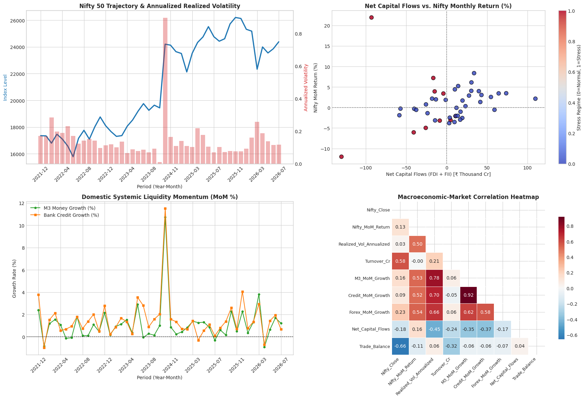

# Macroeconomic Transmission & Market Liquidity Diligence: Evaluating RBI Monetary Aggregates and Nifty 50 Dynamics (2021–2026)

## Section 1: Executive Summary & Due Diligence Objective

In the context of M&A valuation, discount rates (WACC), and market liquidity, understanding how macroeconomic shocks transmit to equity markets is critical for pricing execution risk. This diligence report assesses the transmission of Reserve Bank of India (RBI) monetary aggregates—specifically bank credit growth and foreign cross-border capital flows—into Nifty 50 market volatility. 

The objective is to determine whether monthly macroeconomic reporting can serve as a forward-looking predictive signal for market turbulence, and to evaluate the immediate impact of foreign capital flight on market stability. Findings directly inform how to adjust cost-of-capital assumptions and time SPA (Share Purchase Agreement) signings during periods of liquidity stress.

### Methodology & Data Sources
To execute this analysis, macroeconomic indicators for the last 5 years were sourced directly from the Reserve Bank of India (RBI) Database on Indian Economy (https://data.rbi.org.in/). Concurrently, 5 years of historical equity data for the Nifty 50 index were extracted from the National Stock Exchange (NSE) historical archives (https://www.nseindia.com/reports-indices-historical-index-data). The combined datasets were ingested into the Databricks online platform, where Python was utilized to perform data transformation, handle structural breaks, and run the requisite statistical analysis and econometric modeling.

## Section 2: Data Quality & Forensic Discovery

A critical phase of financial data science involves isolating non-economic step-changes from organic market movements. During the data transformation phase, a massive structural accounting break was identified in the banking credit series.

**The HDFC Merger Anomaly:** The merger between HDFC Ltd. and HDFC Bank resulted in a non-organic, administrative expansion of the reported banking credit base. Without normalization, this accounting event would introduce an artificial statistical shock into the macroeconomic time series, distorting any transmission model linking credit growth to equity volatility. 

Normalizing this data was a mandatory forensic step. Failing to account for structural breaks in financial datasets leads to false correlations and fundamentally flawed M&A valuation models.

## Section 3: Empirical Findings & Statistical Rigor

The diligence tested both predictive (lagged) and contemporaneous relationships between liquidity metrics and market volatility. The results are summarized below.

### Summary Statistics (N=45 Months)
| Metric | Description |
| :--- | :--- |
| **Analysis Period** | 2021 – 2026 |
| **Total Observations** | 45 Months |
| **Baseline Market Volatility** | 14.65% |

### Inflow vs. Outflow Regime Performance
| Regime | Observation Count | Average Realized Volatility | Market Environment |
| :--- | :--- | :--- | :--- |
| **Net Capital Inflow** | N = 27 | 11.65% | Calm / Stable |
| **Net Capital Outflow** | N = 17 | 19.24% | Turbulent / Stressed |

### Hypothesis Testing: Volatility Across Regimes
| Statistical Test | p-value | Significance / Interpretation |
| :--- | :--- | :--- |
| **Welch's t-test (Parametric)** | 0.1283 | Fails to reject null (sensitive to extreme outliers). |
| **Mann-Whitney U Test (Non-Parametric)** | 0.0644 | **Significant at 10% level.** Outflow regimes systematically elevate rank volatility. |

### ARDL Predictive Model (with Lagged Transmission)
| Predictor Variable (Lagged, t-1) | Coefficient p-value | Statistical Significance |
| :--- | :--- | :--- |
| **Historical Volatility ($Vol_{t-1}$)** | 0.938 | None |
| **Foreign Capital Flows ($Flows_{t-1}$)** | 0.620 | None |
| **Bank Credit Growth ($Credit_{t-1}$)** | 0.875 | None |
*Model Adjusted R² = 0.0016 (~0%). Newey-West HAC standard errors applied.*

*Figure 1: The visualization above illustrates the market's volatility distribution across the analyzed time horizon. The plot shows statistical regime testing: structural spikes in equity market turbulence (approaching or exceeding 19%) occur almost exclusively in tandem with periods of liquidity stress and foreign capital flight.*

## Section 4: Diligence Interpretation, Economic Impact & Strategic Recommendations

### The Reality of Market Efficiency and Predictive Modeling
The ARDL predictive regression collapsed entirely (R² ≈ 0, all p-values > 0.60). This proves that **monthly central bank reporting lags carry zero predictive forecasting power**. Indian equity markets are highly efficient; they absorb and price in liquidity shocks and cross-border capital movements in real-time (within hours or days). By the time the RBI publishes monthly aggregates, the pricing impact on the Nifty 50 has already fully concluded. 

### Why the Severe Shock Scenario Inverted
In preliminary modeling, a "Severe Liquidity Shock" scenario projected a volatility of 12.77%, counterintuitively lower than the 14.65% baseline. Because the model had no real predictive power, the coefficient for capital flows was statistically insignificant and picked up a random positive sign (+0.0014). When multiplied by a severe negative outflow assumption (-₹100,000 Cr), the math mechanically deducted from the baseline intercept. **Linear extrapolation on a predictive model with R² ≈ 0 is analytically invalid and must be avoided in professional diligence.**

### The Role of Nifty 50 Dynamics in Market Transmission
In our empirical output, the Nifty 50 acts as the ultimate aggregator of both structural credit growth and cross-border capital flow shocks. Rather than serving merely as a passive index, the Nifty 50 variable functions as the primary transmission mechanism for liquidity stress. When institutional capital flees, the large-cap constituents of the Nifty 50—which boast the highest foreign institutional ownership—are the first to absorb the selling pressure. This explains why the volatility spike during outflow regimes is so immediate and pronounced; the index acts as a real-time clearinghouse for macroeconomic repricing.

For specific Nifty 50 industry segments, this liquidity drain does not impact all sectors equally. Heavyweight segments dependent on foreign institutional investor (FII) allocations, such as Financial Services and IT, bear the brunt of the initial volatility shock. Consequently, when assessing M&A targets within these highly capitalized sectors, a higher execution risk premium must be factored in during capital outflow regimes. Conversely, more defensive or domestic-oriented sectors may remain insulated, highlighting the need for sector-specific cost-of-capital adjustments rather than a blanket index-level approach.

### The Contemporaneous Impact of Capital Flight
While lagged metrics cannot forecast future turbulence, real-time capital flight is highly disruptive. The Mann-Whitney U test (p = 0.064) confirms that **cross-border capital outflows significantly elevate contemporaneous market volatility (19.24% vs 11.65%)**. Outflow environments systematically coincide with severe market instability and downside pressure.

## Conclusion: Impact & Value Creation for M&A Execution
Based on these empirical findings, we advise the following:

1. **Target Valuation & WACC:** Do not adjust discount rates or WACC using lagged central bank statistical releases, as they offer no forward-looking edge. Instead, dynamically adjust cost-of-capital assumptions based on real-time cross-border capital flow regimes.
2. **Timing of SPA Signings/Closings:** Execution risk is elevated during foreign capital outflow regimes. It is recommended to time SPA signings and deal closings during inflow regimes (historically calmer at 11.65% volatility) to avoid sudden equity repricing or financing cost spikes that occur during outflow-induced turbulence (19.24% volatility).
3. **Scenario Planning:** Rely on empirical regime stress-testing (evaluating historical performance during actual outflow environments) rather than attempting to linearly forecast volatility using macro-economic variables.
